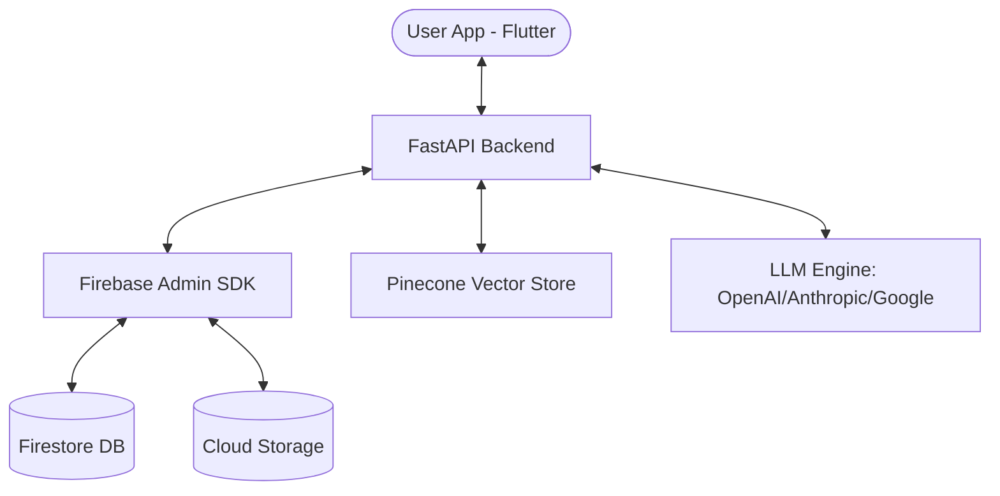

# LearnLens 🎓

LearnLens is a premium, AI-powered learning platform that transforms static materials into interactive, hyper-personalized assessments. By leveraging advanced LLMs and Vector Embeddings, LearnLens analyzes your study materials—whether they are PDFs, docs, or handwritten notes—to generate smart quizzes and provide deep performance insights.


---

## 🏗️ System Architecture

LearnLens follows a modern decoupled architecture:



- **Frontend**: A high-performance Flutter mobile application with a focus on premium aesthetics and smooth UX.
- **Backend**: A robust FastAPI service handling complex AI generation, vector search, and data processing.
- **Data Engine**: A hybrid storage system using Firebase Firestore for structured data and Pinecone for semantic search capabilities.

---

## ✨ Key Features

### 📱 Mobile Experience (Frontend)
- **Premium B&W Theme**: High-contrast, minimalist design optimized for cognitive focus.
- **Optimistic UI**: Instant document deletion and snappy interactions.
- **Adaptive Assessments**: Support for Multiple Choice (MCQ) and descriptive short answers.
- **Real-time Progress**: Visual tracking of your mastery levels per document.

### 🧠 Intelligence Layer (Backend)
- **Smart Chunking**: Intelligent text splitting for optimal context retrieval.
- **RAG-Powered Generation**: Retrieval-Augmented Generation (RAG) ensures questions are accurate to the source material.
- **Multi-Model Support**: Integrated with OpenAI GPT-4o, Anthropic Claude 3.5, and Google Gemini Pro.
- **OCR Engine**: Advanced image processing via EasyOCR and Pillow for capturing handwritten or printed notes.
- **Auto-Evaluation**: AI-driven grading for descriptive answers with detailed feedback.

---

## 🛠️ Technical Stack

### **Frontend (Flutter)**
- **State Management**: [flutter_bloc](https://pub.dev/packages/flutter_bloc)
- **Navigation**: [go_router](https://pub.dev/packages/go_router)
- **Networking**: [dio](https://pub.dev/packages/dio) / [api_client]
- **Iconography**: [Material Symbols Outlined]
- **Typography**: [Google Fonts (Manrope, Inter)]

### **Backend (Python)**
- **Framwork**: [FastAPI](https://fastapi.tiangolo.com/)
- **ORM/DB**: [Firebase Firestore](https://firebase.google.com/docs/firestore)
- **Vector Store**: [Pinecone](https://www.pinecone.io/)
- **Orchestration**: [LangChain](https://www.langchain.com/)
- **Processing**: [EasyOCR], [PyPDF2], [python-docx]

---

## 🚀 Getting Started

### 1️⃣ Prerequisites
- Flutter SDK (latest stable)
- Python 3.9+
- Firebase Project
- Pinecone API Key
- LLM API Key (OpenAI, Anthropic, or Google)

### 2️⃣ Backend Setup
```bash
cd backend
# Install dependencies
pip install -r requirements.txt
# Set up environment variables
cp .env.example .env # Fix with your keys
# Run the server
python run.py
```
*API docs available at `http://localhost:8000/api/v1/docs`*

### 3️⃣ Frontend Setup
```bash
cd learnlens
# Install dependencies
flutter pub get
# Add Firebase config files
# Android: google-services.json
# iOS: GoogleService-Info.plist
# Run the app
flutter run
```

---

## 📂 Project Structure

```text
LearnLens/
├── learnlens/             # Flutter Mobile Application
│   ├── lib/
│   │   ├── bloc/          # State management logic
│   │   ├── screens/       # UI Pages
│   │   └── core/          # Networking & Router
├── backend/               # FastAPI AI Service
│   ├── app/
│   │   ├── api/           # Endpoints
│   │   ├── services/      # AI & Business logic
│   │   └── models/        # Data schemas
│   └── run.py             # Entry point
└── README.md              # Master Documentation
```

---

Built with ❤️ by [Varad Singhal](https://github.com/VaradSinghal)
